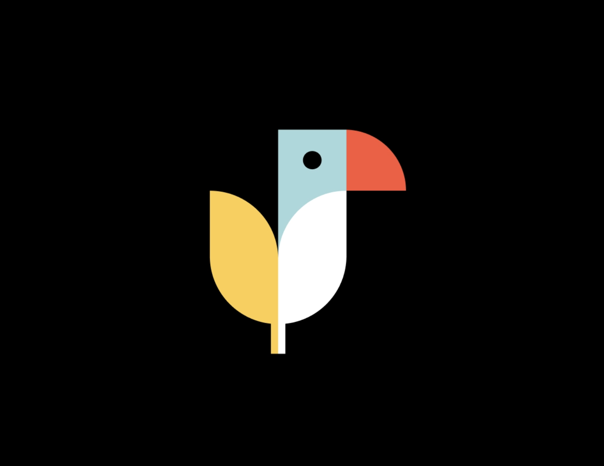

# toepol
Making Dutch open data more easily accesible by integrating the following open source projects and cloud technologies:

## Open source technologies
- [NLextract](https://github.com/nlextract/NLExtract): stetl-based processing of geographic reference data
- [Apache Parquet](https://parquet.apache.org/): parquet as the most common data exchange format
- [Delta Lake](https://delta.io/): historisation with parquet
- [Apache Sedona](https://sedona.apache.org/): geodata on Spark datalakes

## Reference implementation with commercial technology vendors
- [Prefect](https://prefect.io): orchestration
- [Azure Datalake gen2](https://docs.microsoft.com/en-us/azure/storage/blobs/data-lake-storage-introduction) and [PowerBI](https://powerbi.microsoft.com)

